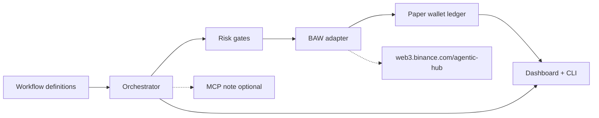

# ChainPulse

Track A product for the **Binance Agent OS Mini Hackathon 2026**.

**Onchain Workflows** — automated staking and multi-app DeFi interactions via
**Binance Agent OS BAW / Wallet Agentic Hub**
(https://web3.binance.com/agentic-hub),
with optional MCP for CEX market/context.

## Dual-rail Agent OS (BAW primary)

| Rail | Role | Endpoint |
|------|------|----------|
| **BAW** (primary) | Wallet / on-chain ops under documented daily caps | `https://web3.binance.com/agentic-hub` |
| **MCP** (optional) | CEX context via OAuth | `https://agent.binance.com/mcp/agentic` (`oauth_client_id=grok`) |

Paper/mock when live is unavailable; every mock path is labeled. **No external withdrawals.**

## Features

- Automated staking — liquid-stake style paper flow
- Multi-step DeFi — swap then stake saga with rollback notes
- BAW adapter — balances, approve, stake, unstake, swap, daily caps, kill-switch
- Risk — max notional per step, max steps/day, kill-switch, confirm each workflow
- CLI demo asserts stake PASS + multi-app PASS + over-cap REJECT
- Vite React dashboard — workflow list, step log, wallet balances, BAW status

## Architecture

See mermaid diagram below.

## Quick start

Install deps, then run the demo script, then start the Vite dashboard on port 5174.
Keep paper mode for demos.

## Scripts

| Script | Purpose |
|--------|--------|
| demo | Stake + multi-app + over-cap; asserts PASS |
| dev | Vite dashboard |
| cli | Single workflow JSON |
| build | Typecheck + Vite build |

## Key files

- src/core/ — workflows, orchestrator, risk, types
- src/adapters/bawWallet.ts — BAW paper/mock adapter
- src/adapters/mcpContext.ts — optional MCP note
- src/cli/demo.ts — demo runner with assertions
- src/ui/ — React dashboard
- src/data/fixtures/ — prices + protocol stubs
- AGENT_OS_NOTES.md, DEMO.md, BRIEF.md

## Documented BAW daily caps (defaults — not guarantees)

| Cap | Documented default |
|-----|-------------------|
| Swaps | ~USD 50000 / day |
| DeFi | ~USD 100000 / day |
| x402 | ~USD 20 / day |

Confirm live quotas in the Binance App / wallet settings.

## Disclaimer

Not financial advice. Paper and mock fills are not live on-chain transactions.
Live Agent OS / Agentic Hub actions require user confirmation. No withdrawal scope.
Documented caps are public defaults — not invented guarantees.
